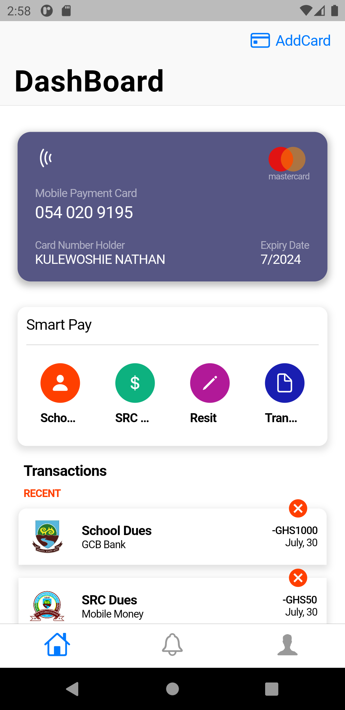
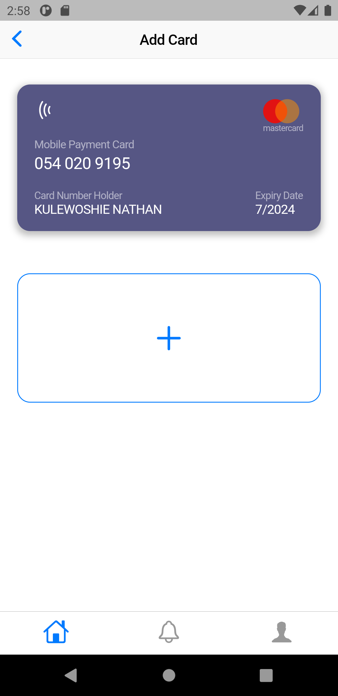
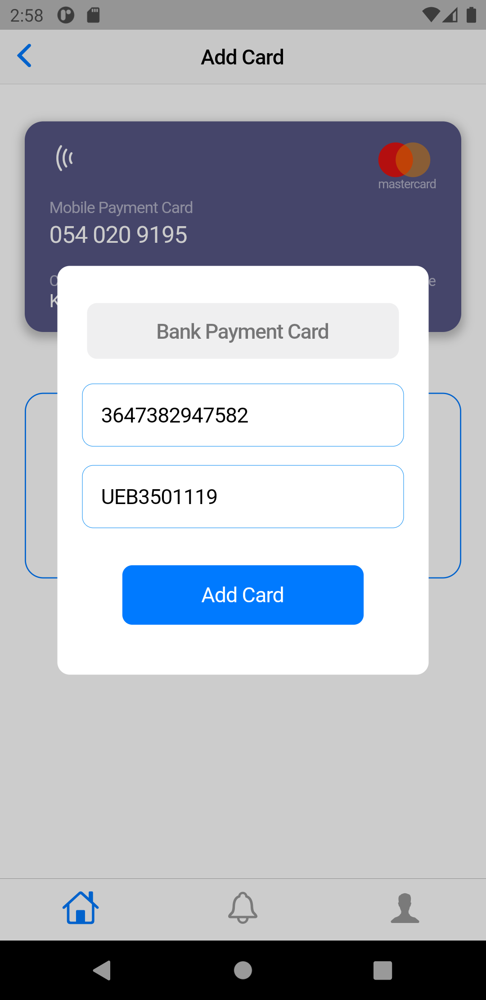
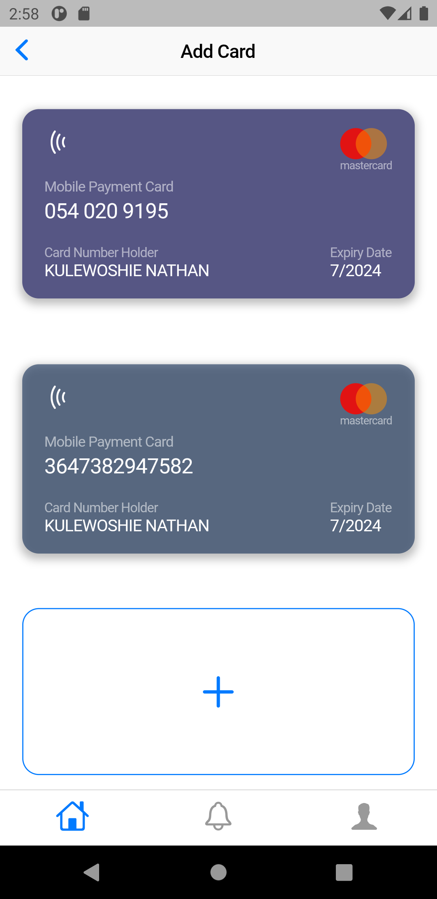

# UNI-PORT

DIGITIZING UNIVERSITIES.

## Mobile Version

This is the mobile version of a financial system that would help students of all universities to make any school related transactions.

 

 

## Web Version

This is the mobile version of a financial system that would help students of all universities to make any school related transactions. 
[Link to the web project file](https://github.com/acquahsamuel/hackathon-src-api)

 

 
